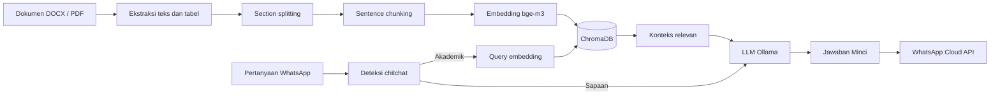

<div align="center">

<h1>MINCI</h1>
<p><strong>Virtual Assistant for STT Cipasung</strong></p>
<p>Chatbot WhatsApp berbasis Retrieval-Augmented Generation untuk informasi PMB, KRS, jadwal, dan biaya kuliah.</p>

<p>
  <a href="https://www.python.org/"></a>
  <a href="https://fastapi.tiangolo.com/"></a>
  <a href="https://ollama.com/"></a>
  <a href="https://www.trychroma.com/"></a>
</p>
<p>
  <a href="https://developers.facebook.com/docs/whatsapp/cloud-api"></a>
  <a href="https://ngrok.com/"></a>
  
</p>

</div>

<div align="center">
<table>
<tr>
<td align="center"><strong>4</strong><br>domain knowledge</td>
<td align="center"><strong>25</strong><br>indexed chunks</td>
<td align="center"><strong>1</strong><br>WhatsApp webhook</td>
<td align="center"><strong>0</strong><br>cloud LLM dependency for core chat</td>
</tr>
</table>
</div>

## Tentang Proyek

Minci adalah asisten virtual akademik untuk STT Cipasung. Sistem menerima pertanyaan melalui WhatsApp, mengambil konteks yang relevan dari dokumen kampus, kemudian menghasilkan jawaban menggunakan model bahasa lokal melalui Ollama.

Ruang lingkup informasi:

- Penerimaan Mahasiswa Baru (PMB)
- Kartu Rencana Studi dan registrasi ulang (KRS)
- Kalender dan jadwal akademik
- Biaya dan uang kuliah

Jawaban Minci dibatasi oleh dokumen referensi. Jika informasi tidak ditemukan atau tidak relevan, sistem tidak mengarang jawaban dan mengarahkan pengguna ke Tata Usaha STT Cipasung.

## Alur RAG

Dokumen DOCX/PDF diekstrak, dipisah menjadi section dan chunk, lalu diubah menjadi embedding `bge-m3` dan disimpan di ChromaDB. Saat pertanyaan masuk, sistem mengambil chunk paling relevan sebagai konteks LLM.



## Fitur

<table>
<tr>
<td width="50%" valign="top">

### RAG dan Dokumen

- Mendukung DOCX dan PDF
- Mengekstrak teks serta tabel
- Embedding kontekstual berdasarkan judul dokumen
- Retrieval dengan over-fetch, filter jarak, dan top-k
- Database vektor persisten menggunakan ChromaDB

</td>
<td width="50%" valign="top">

### Percakapan

- Webhook WhatsApp berbasis FastAPI
- Riwayat percakapan menggunakan SQLite
- Pertanyaan lanjutan diubah menjadi pertanyaan mandiri
- Deteksi chitchat tanpa retrieval akademik
- Deduplikasi pesan WhatsApp selama 24 jam

</td>
</tr>
<tr>
<td width="50%" valign="top">

### Local-first AI

- Chat dan embedding berjalan melalui Ollama
- Ollama diperiksa dan dapat dinyalakan otomatis
- Dokumen tidak perlu dikirim ke LLM cloud untuk penggunaan utama
- Model dapat diganti melalui `.env`

</td>
<td width="50%" valign="top">

### Evaluasi

- Hit Rate, Precision, Recall, dan NDCG
- Stress test dan pengujian faithfulness
- Gemini sebagai judge opsional
- Laporan disimpan di `rag/eval_reports/`

</td>
</tr>
</table>

## Struktur Proyek

```text
Virtual-Asisten-Minci/
├── app.py                 # FastAPI webhook WhatsApp
├── run_server.py          # Server lokal dan tunnel ngrok
├── ollama_utils.py        # Pemeriksaan server dan model Ollama
├── requirements.txt       # Dependensi Python
├── .env.example           # Template konfigurasi rahasia
├── documents/             # Dokumen sumber akademik DOCX / PDF
├── dataset/               # Dataset chitchat dan evaluasi
└── rag/
    ├── config.py          # Path, model, prompt, dan parameter RAG
    ├── ingest.py          # Ingest dokumen ke ChromaDB
    ├── query.py           # Retrieval, riwayat chat, dan mode CLI
    ├── evaluate_rag.py    # Evaluasi retrieval dan jawaban
    ├── dataset/           # Database vektor hasil ingest
    ├── database/          # SQLite chat history
    └── eval_reports/      # Laporan evaluasi
```

## Prasyarat

- Python 3.10 sampai 3.12
- Ollama tersedia di `PATH`
- Model embedding `bge-m3`
- Model chat, misalnya `llama3.2` atau model custom `minci`
- WhatsApp Cloud API untuk integrasi WhatsApp
- ngrok untuk webhook yang dapat diakses dari internet

## Instalasi

Jalankan perintah berikut dari root repository.

### Windows PowerShell

```powershell
python -m venv .venv
.\.venv\Scripts\Activate.ps1
pip install -r requirements.txt
```

### macOS atau Linux

```bash
python3 -m venv .venv
source .venv/bin/activate
pip install -r requirements.txt
```

### Siapkan Ollama

```bash
ollama pull bge-m3
ollama pull llama3.2
```

Model chat default adalah `minci`. Jika model tersebut belum tersedia, isi `.env` dengan:

```env
LLM_MODEL=llama3.2
EMBED_MODEL=bge-m3
```

### Siapkan environment

Salin template konfigurasi dan isi nilainya:

```powershell
Copy-Item .env.example .env
```

| Variabel             | Kegunaan                        |
| -------------------- | ------------------------------- |
| `LLM_MODEL`          | Model chat Ollama               |
| `EMBED_MODEL`        | Model embedding Ollama          |
| `WA_VERIFY_TOKEN`    | Token verifikasi webhook Meta   |
| `WA_ACCESS_TOKEN`    | Access token WhatsApp Cloud API |
| `WA_PHONE_NUMBER_ID` | ID nomor WhatsApp bisnis        |
| `NGROK_AUTH_TOKEN`   | Token tunnel ngrok              |
| `GEMINI_API_KEY`     | API key judge evaluasi          |

Jangan commit `.env`; file tersebut sudah masuk `.gitignore`.

### Siapkan dokumen

Letakkan dokumen akademik pada `documents/`. Format yang didukung adalah `.docx` dan `.pdf`. Dataset `chitchat.json`, `ground_truth.json`, dan `stress_cases.json` berada di `dataset/`.

## Menjalankan Sistem

### Ingest dokumen

```bash
python -m rag.ingest
```

Jalankan ulang setiap kali dokumen di `documents/` berubah. Database vektor akan dibangun ulang di `rag/dataset/`.

### Mode CLI

```bash
python -m rag.query
```

Ketik pertanyaan di terminal. Gunakan `exit` untuk keluar.

### Webhook lokal

```bash
python run_server.py --no-ngrok
```

Health check tersedia di `http://127.0.0.1:8000/`.

### Webhook publik dengan ngrok

```bash
python run_server.py
```

Masukkan URL yang dicetak server dengan suffix `/webhook` ke konfigurasi webhook WhatsApp di Meta for Developers.

```bash
python run_server.py --host 0.0.0.0 --port 8001
python run_server.py --no-ngrok --port 8001
```

### Evaluasi RAG

```bash
python -m rag.evaluate_rag
```

Evaluasi membutuhkan dataset pada `dataset/`. Isi `GEMINI_API_KEY` jika menggunakan judge Gemini.

## Konfigurasi RAG

Parameter utama berada di [rag/config.py](rag/config.py):

| Parameter                 | Default | Fungsi                             |
| ------------------------- | ------: | ---------------------------------- |
| `CHUNK_SIZE`              |   `512` | Ukuran chunk dokumen               |
| `CHUNK_OVERLAP`           |    `50` | Overlap antar-chunk                |
| `TOP_K`                   |     `3` | Jumlah konteks akhir               |
| `RETRIEVE_FETCH_K`        |     `8` | Jumlah kandidat retrieval awal     |
| `DISTANCE_THRESHOLD`      |  `0.65` | Batas relevansi retrieval          |
| `MAX_HISTORY_TURNS`       |     `6` | Turn percakapan yang dipertahankan |
| `HISTORY_TIMEOUT_SECONDS` |  `3600` | Masa berlaku riwayat               |

Path proyek dapat dipindahkan melalui environment variable `MINCI_BASE_DIR`.

## Keamanan dan Batasan

- Simpan token WhatsApp, ngrok, dan Gemini hanya di `.env`.
- Pesan WhatsApp non-teks saat ini diabaikan.
- Kualitas jawaban bergantung pada kelengkapan dokumen dan kualitas embedding.
- Server default bind ke `127.0.0.1`; gunakan `--host 0.0.0.0` bila perlu diakses perangkat lain.
- Hentikan server sebelum menjalankan ingest ulang agar database tidak terkunci, terutama di Windows.

## Lisensi

Lihat [LICENSE](LICENSE) untuk informasi lisensi proyek.

<div align="center"><sub>Minci membantu akses informasi akademik yang cepat, terarah, dan berbasis dokumen.</sub></div>
